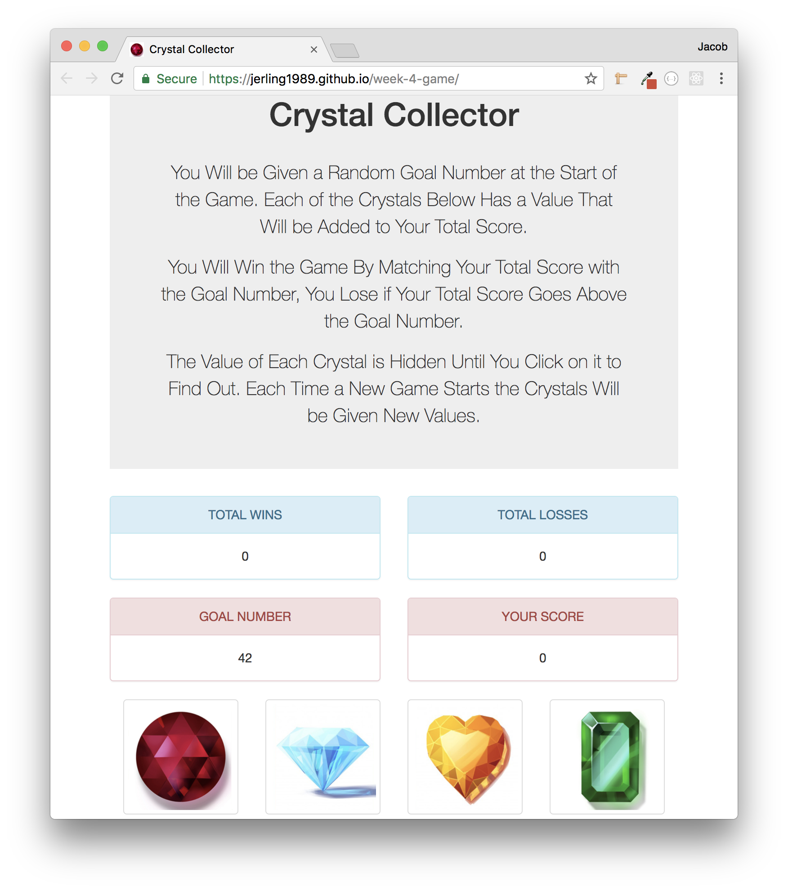

# week-4-game
This is a simple yet fun game I made with HTML, CSS, and JavaScript. For the CSS I used Twitter Bootstrap which helped with the speed in which I built the game, as well as the Mobile Responsiveness. I also used jQuery for the JS file, which made it easy to select certain HTML Elements and manipulate the game. I also added sound effects on the Gem Buttons which gave the game a little more style.

The rules of the game are very simple, at the start of each round there is a randomly generated "Goal Number", this is the number the user wants to get to. Each one of the Gems will each have a random value at the start of each game as well. If the user matches the "Goal Number" exactly they win, if the go over the number they lose.

---

- Here you can see what the game looks like upon initial page load. There is the Game Title, Instructions, Gem Buttons, and the Goal Number for the round. You'll notice since this is the first round there are no Wins or Losses tracked and no User Score yet.

- This next image is here to show how the user's Wins, Losses, and Current Score are tracked during thier session on the game.

